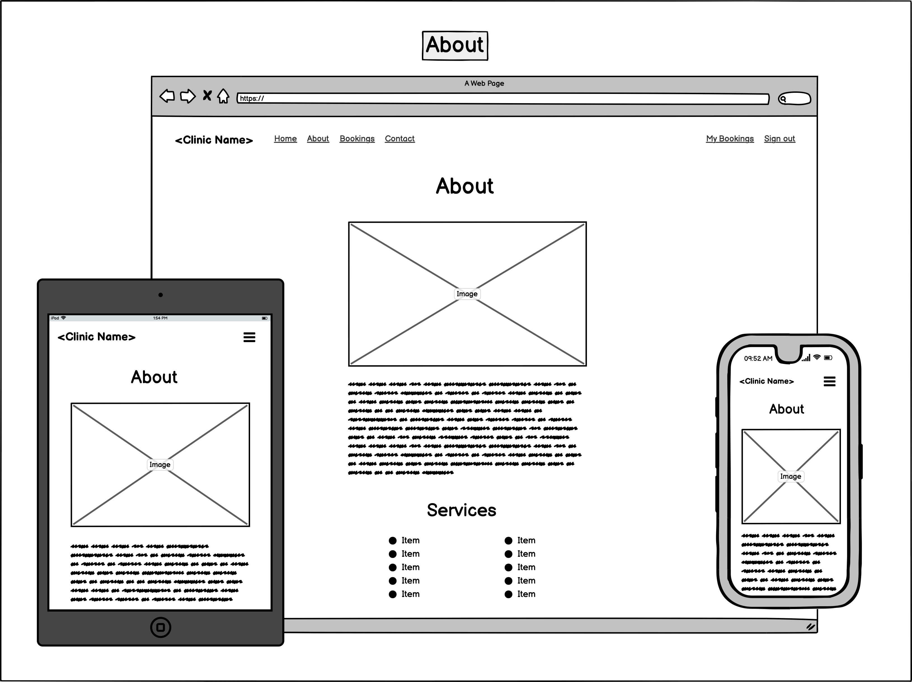
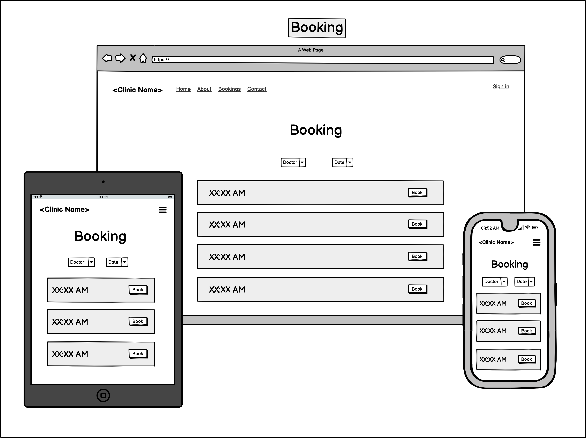
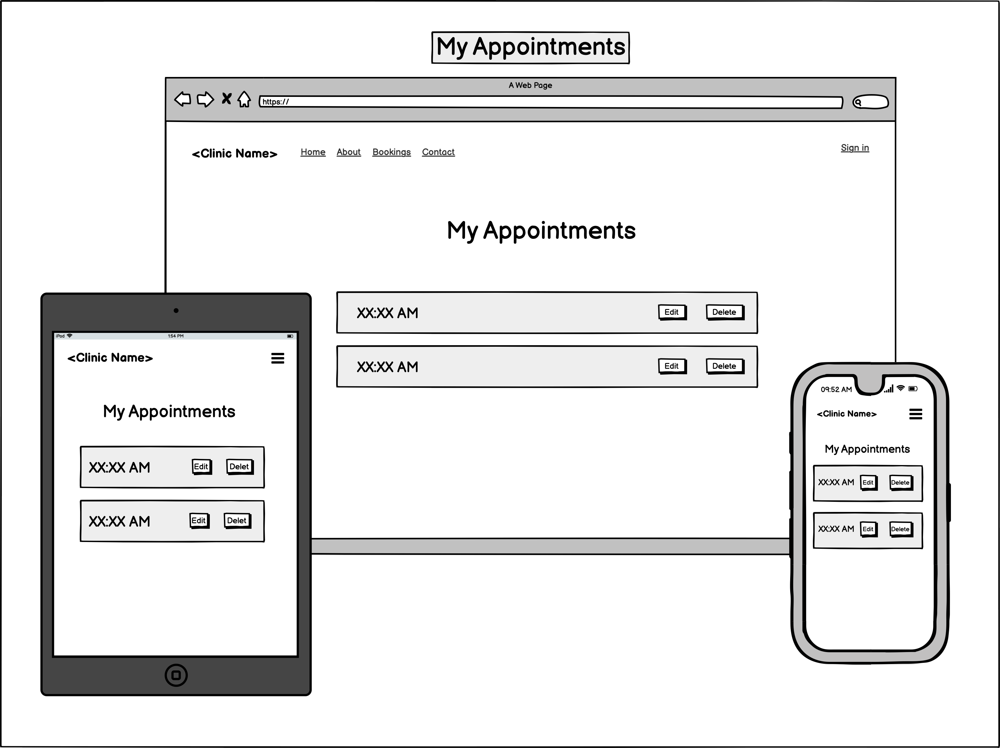
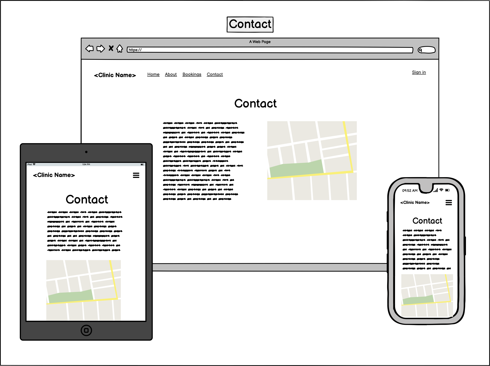

# Medical Clinic Booking App

## General Description and Purpose

The repo contains the source code and other assets for our MERN-stack application. Links to the hosted version of the application will be included here when available.

### Purpose
Our app connects a medical practice with its patients. It provides an "all-in-one" solution to booking and managing appointments, viewing and selecting practice services, and accessing notes and resources from an appointment. The app caters for three types of user:

- **Medical Clinic Managers:** The app will allow clinic managers to platform to advertise available services, track appointments, and streamline the booking process.

- **Doctors:** The app allows the management and tracking of appointments, and provides an easy way to update availability throughout the day/week.

- **Patients:** The app presents a simple way to book appointments and select from various medical services.

### Features

The website section of the app allows practices to advertise their services (general consultations, care plan consultations, etc) as well as provide information about their doctors. Contact information and other details for the practice can also be included, to expand online presence. The booking section of the app allows end-users from the practice to quickly check and manage appointments, and set/manage availability of their practitioners.

Patient end-users are able to sign up for and account and login. After this, they can view doctor availability, make and manage appointments, and access any included information for upcoming or past appointments. Patients will also be able to manage personal information provided to the practice through their user accounts, and close an account at any time.

Secure login and sign-up will be provided through a blend of in-house configuration and third-party services.

### Target Audience

The app is intended for medical practices, as a simple way to to deliver online presence and a simple booking experience for patients.

### Tech Stack

Our app is built on the following technologies:

#### Front End
- CSS
- HTML
- React
- Ant Design
- Tailwind

#### Back End
- Express
- JWT
- MongoDB
- Mongoose
- Node.js

#### Third-party Services
- auth0
- Cloudinary
- Heroku
- Netlify
- MongoDB Atlas

---

## Application Architecture Diagram

---

## Dataflow Diagram 

---

## UML Sequence Diagram

---

## User Stories

| User    | Action                                                      | Result                                                                               |
|---------|-------------------------------------------------------------|--------------------------------------------------------------------------------------|
| Patient | Create an account                                           | So I can securely and conveniently book appointments                                           |
| Patient | Sign in to my account                                       | So I can access services in the app                                                  |
| Patient | Add my personal details to my account                       | So I can save time when booking with my doctor                   |
| Patient | Edit my personal details on my account                      | So I can provide the clinic with up-to-date information and control my personal information |
| Patient | Book an appointment online                                  | So I can book a doctor conveniently and easily                                                  |
| Patient | Choose a doctor for my appointment                          | So I can feel more comfortable about which doctor I am seeing                        |
| Patient | Choose a date and time for my appointment                   | So I can fit the appointment into my busy schedule                                   |
| Patient | Add a comment when booking an appointment                   | So I can provide the doctor with any extra information                               |
| Patient | See the details of a booking                                | So I can confirm the booking details                                                 |
| Patient | View all my current bookings                                | So I can see how many bookings I have                                                |
| Patient | View all my previous bookings                               | So I can see details from past appointments                                          |
| Patient | Access any medical reports/scans from previous appointments | So I can download them to use for other purposes                                     |
| Patient | Make changes to a booking                                   | So I can manage bookings around any changes in my schedule                           |
| Patient | Get notified of any changes to my bookings                  | So I can be properly prepared and organise my time                                                     |
| Patient | Cancel a booking                                            | So I can adapt to my changing needs                                                 |
| Patient | Delete my account                                           | So I can control my personal information and reduce my online footprint                           |
| Admin   | View a patients booking details                             | So doctors can prepare for their appointments                                        |
| Admin   | View all current bookings for each doctor                   | So I can plan the week                                                               |
| Admin   | Edit a patients booking                                     | So I can adjust appointments if any changes arise                                    |
| Admin   | Delete a patients booking                                   | So I can deal with cancellations and other changes                                   |
| Admin   | Provide doctor availabilities                               | So patients know when they can book appointments                                     |
| Admin   | Get notified when a patients booking changes                | So doctors can adjust their schedule/plans as needed                                |
| Admin   | Combine our online presence with an easy booking system     | So patients can find everything they need in one place                               |
| Admin   | Advertise about the services we provide                     | So potential patients understand what we do                                          |
| Admin   | Provide a bio for all the doctors                           | So patients can choose a doctor they're comfortable with                           |

---
  
## Wireframes

---

## Kanban Screenshots

